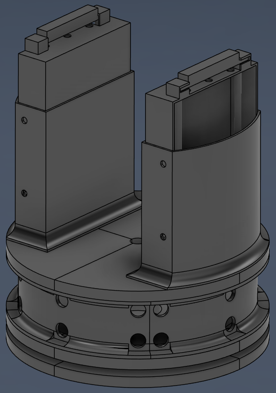

# Autonomous Nerf Turret

## Overview
Work-in-progress mechatronics project involving a 3D-printed turret chassis, Raspberry Pi-based control system, motorized pan/tilt actuation, and YOLO/OpenCV target tracking.

## Project Goals
- Design and 3D print a stable turret chassis
- Implement manual controller-based aiming
- Develop autonomous target tracking using computer vision
- Integrate motors, motor drivers, power distribution, and Raspberry Pi control

## Technologies Used
- Fusion 360
- Raspberry Pi 5
- Python
- OpenCV
- YOLO object detection
- Motor drivers
- Soldering and wiring
- 3D printing

## CAD Render

## Current Status
- Mechanical chassis designed in Fusion 360 [finished]
- 3D-printed prototype chassis parts [finished]
- Electrical wiring and motor driver integration [in progress]
- Raspberry Pi control and computer vision system [in development]

## Planned Improvements
- Camera alignment calibration
- Motor response testing
- Autonomous tracking validation
- Power management refinement
